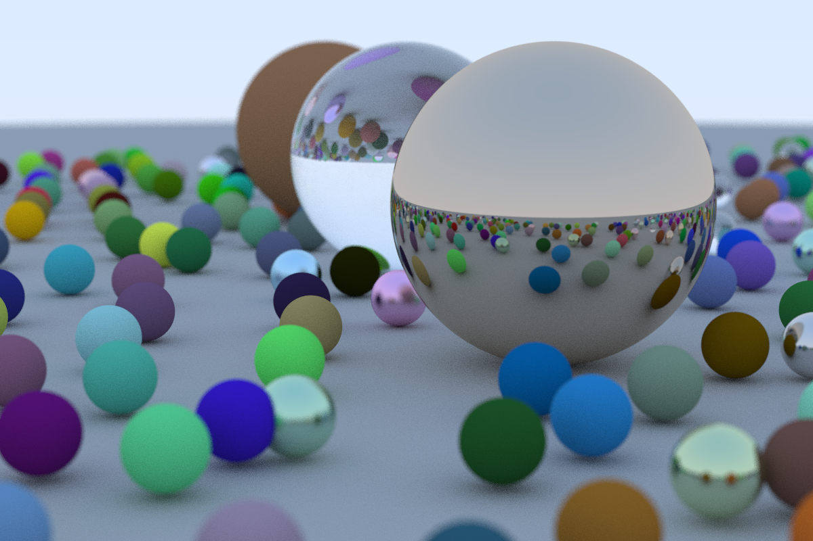
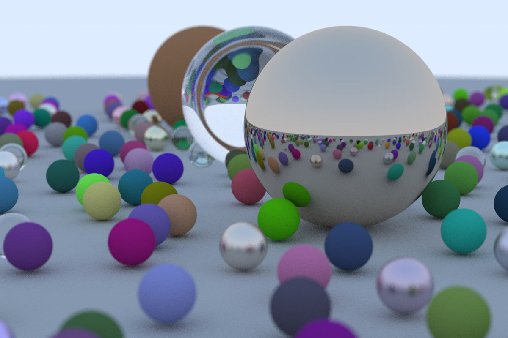
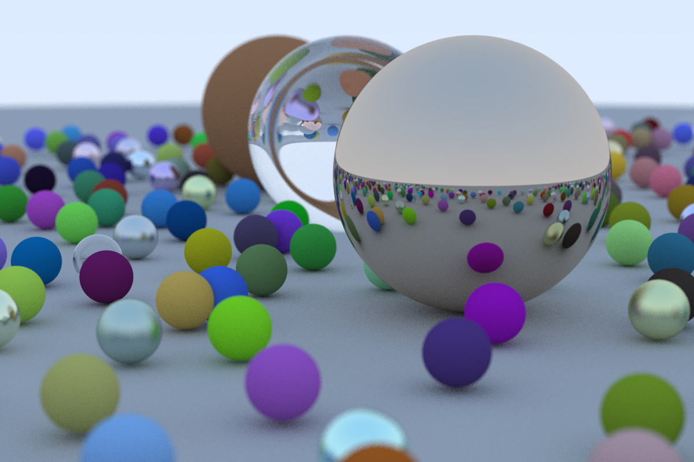

Learning Ray Tracing (from scratch) and adapting [The Ray Tracing in One Weekend series](https://raytracing.github.io/) to C#.

The main goals here is to learn ray tracing and improve my C# skills.

For now I'm trying to improve performance.

Execution time (for the image below): **61.16 minutes**. 
Aspect ratio: 3:2 | Image Width: 1200px | Samples per pixel: 100 | Max ray bounce: 50 | Number of spheres: 488

---

First round of optimizations.

Execution time (for the image below): **42.01 minutes**. 
Aspect ratio: 3:2 | Image Width: 1200px | Samples per pixel: 100 | Max ray bounce: 50 | Number of spheres: 488

---

Second round of optimizations.

Execution time (for the image below): **38.29 minutes**. 
Aspect ratio: 3:2 | Image Width: 1200px | Samples per pixel: 100 | Max ray bounce: 50 | Number of spheres: 488

