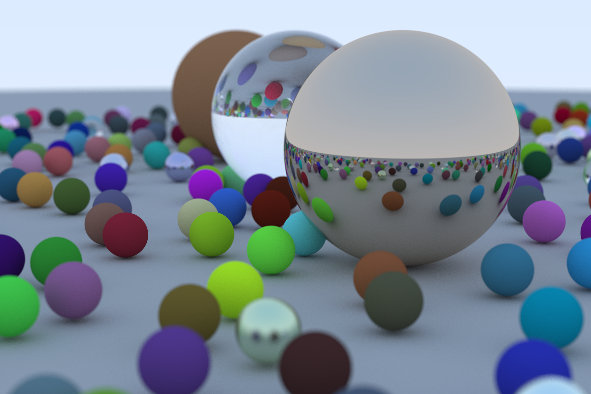

Learning Ray Tracing (from scratch) and adapting [The Ray Tracing in One Weekend series](https://raytracing.github.io/) to C#.

The goals here are to learn ray tracing, create a basic and functional one, and improve my C# skills.

Execution time (for the image below): **1h40min**. 
Aspect ratio: 3:2 | Image Width: 1200px | Samples per pixel: 500 | Max ray bounce: 50 | Number of spheres ~ 480. 

